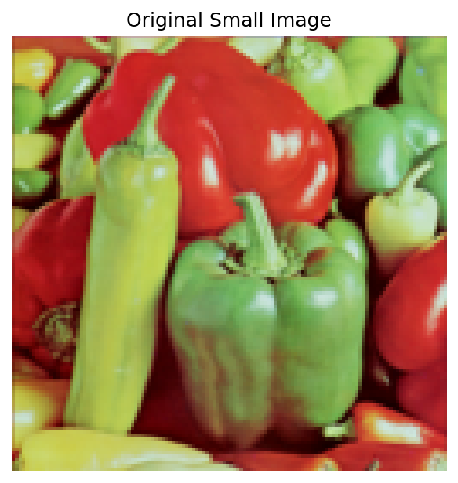
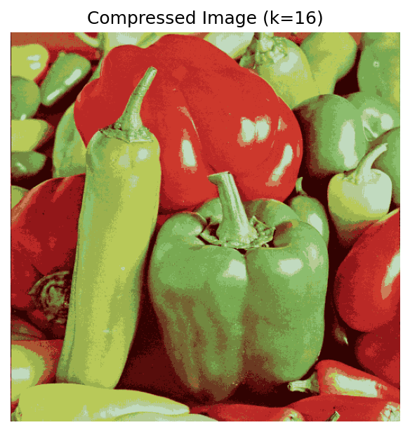

# Question 4: K-means Clustering for Image Compression

## Part (a): Implementation

Done in k_means.py

## Part (b): Results and Visual Comparison


### Original Small Image (128×128)


### Original Large Image (512×512)


### Compressed Large Image (16 colors)


### Visual Analysis
The compressed image maintains good visual quality with only 16 colors. The peppers' red, yellow, and green tones are well-preserved, and edges remain clearly visible. Some color banding appears in gradient regions, which is expected with quantization to 16 colors.

## Part (c): Compression Factor

### Original Image
- Size: 512 × 512 = 262,144 pixels
- Storage: 262,144 pixels × 3 bytes (RGB) = **786,432 bytes**

### Compressed Image
Storage consists of:
1. **Centroids**: 16 colors × 3 bytes = 48 bytes
2. **Assignments**: 262,144 pixels × 4 bits = 131,072 bytes
   - Each pixel needs log₂(16) = 4 bits to encode its cluster assignment

**Total compressed size**: 48 + 131,072 = **131,120 bytes**

### Compression Factor
```
Compression Factor = 786,432 / 131,120 = 6.00
```

The image is compressed by a factor of **6×**, using only 16.67% of the original size with 83.33% space savings.
